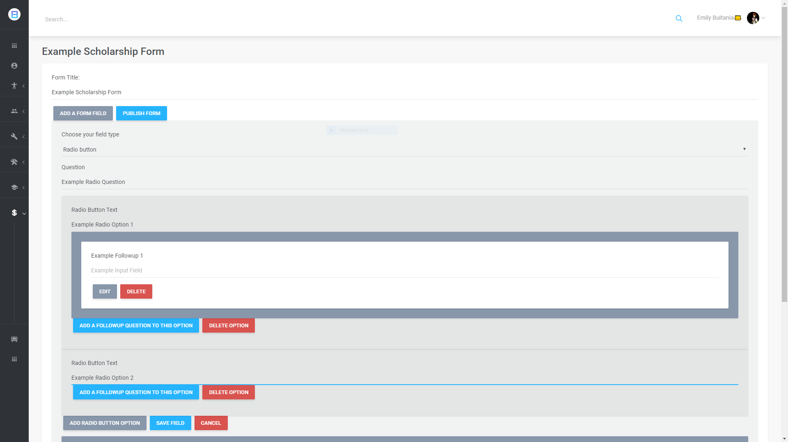
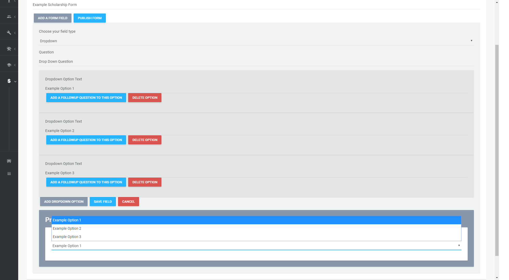

<h3>This is a repository for samples of my code from a previous project</h3>

In here you will find 2 folders: 
	-Mobile App contains files from the components I worked on for the mobile app built with React Native and Node.JS
	-Web App contains files from the components I worked on for the web app which was built with Typescript React and ADO.NET.

The Mobile App folder contains one folder for NodeJS and one folder for React Native. 

The NodeJs folder contains the API endpoints for my mobile app built with Node.Js. API endpoint routing was accomplished using Express.JS. 

-I used the node library, NodeMailer, to send emails in my API services to allow users to confirm their email as well as reset a forgotten password.

-Using the built in crypto library in Node, I built a salt and hash generator that reproduced the same pbkdf2 hash and salt strings that our .NET 
		framework produced so that user that registered	through our web app would be able to log in on the app and vice versa.
	
-I also implemented a service to generate and verify JSON web tokens so that app users would stay logged in while the token was not expired. The token
		is used to verify authentication so that only logged in users are able to access the app views.

The React Native folder contains the react native components that I worked on in the mobile app

The Web App folder contains one folder for React components, one folder for the ADO.NET MVC Controllers and one folder for MVC Services.

The React folder contains the typescript react components I worked on for the web app.
		
-Most notable is my component that allowed funding organizations to build their own scholarship forms for users to fill out. This was done through
dynamic rendering based on user's choices. I implemented the ability for admins to add standard input questions as well as multiple choice questions
using both checkbox for multiple answers allowed as well as radio buttons for allowing only one answer. I also implemented dropdown questions so admins
can provide users with a dropdown with options.
-Another feature of the form builder is the option to allow admins to attach a follow up question to  a specific option for radio button questions as
well as dropdown options. This means the followup question will only render on the user's form if they select a specific answer choice.

-The other component that is included in the folder is the real time chat for the web app. Using signalr, I implemented a chat with real time message 
updates. They is done by telling every client in a "chatroom" to update their state to rerender with a new message

The Controller folder contains the C# Controllers which handled the API endpoint routing by taking the request and returning the correct response.
	
The Services folder contains the C# Services that interact with the SQL database. This is where we use System.Data execute non-queries, execute readers, and 
execute scalars to fire a SQL stored procedure and read through the return data sets. 

Aaron Chu
aarondchu@gmail.com
linkedin.com/in/aarondchu
github.com/aarondchu
